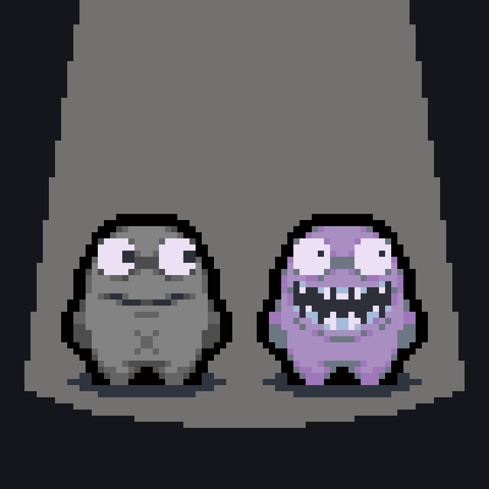

<p align="center">
  
</p>

<h1 align="center">ROCK</h1>

<p align="center">
  <strong>ROCK is a programmable runtime for Lua-scripted multiplayer worlds.</strong>
</p>

## Documentation

Start with the scripting guide:

- [Full documentation](DOCS.md)
- [Architecture notes](ARCHITECTURE.md)

## What is ROCK?

ROCK is a multiplayer runtime for building online worlds with Lua. The runtime owns the boring hard parts: sockets, sessions, entity replication, persistence, async work, timers, and event routing. Your gamemode stays close to the thing you actually want to write.

The Lua DSL is inspired by SA-MP Pawn gamemodes and ReactiveX:

```lua
on.player.online()
  :each(function(p)
    print("player connected", p:id())
  end)

on.player.input()
  :bind_action("Jump")
  :skip(2)
  :take(1)
  :each(function(p)
    print("third jump goes higher")
  end)
```

## Quick Start

### Requirements

- Rust toolchain
- SQLite is used internally through the runtime dependencies
- A Lua gamemode file in `gamemodes/`

### Build

From the repository root:

```bash
cargo build --release
```

### Prepare a server directory

ROCK reads `config.toml`, `gamemodes/`, `geodes/`, `assets/`, and `db/` from the current working directory. In practice, build the binary and run it from the directory that contains your server files.

```bash
rock genesis my_gamemode
```

Or copy the included example:

```bash
mkdir -p gamemodes
cp /path/to/rock/examples/freeroam.lua gamemodes/freeroam.lua
```

For the copied example, set `name = "freeroam"` in `config.toml`.

This creates:

```txt
gamemodes/my_gamemode.lua
config.toml
assets/
```

Minimal `config.toml`:

```toml
[gamemode]
name = "my_gamemode"
```

### Launch

```bash
rock ignite
```

By default, the server listens on `127.0.0.1:3000`.

Clients connect via WebSocket:

```txt
ws://127.0.0.1:3000
```

## Example Gamemode

A sample gamemode is available at:

```txt
examples/freeroam.lua
```

Tiny example:

```lua
local player_bp = entity.blueprint()
  :name("player")
  :position({ x = 0, y = 0 })
  :custom({ health = 100 })

player_bp:sync()
  :only(function(c) return { c.position, "health" } end)
  :commit()

on.player.online()
  :each(function(p)
    local ent = player_bp:spawn():room("world")
    ent:owned_by(p:id())

    p:vision():attach(ent)
    p:signal("Identity"):data({ pid = p:id(), room = "world" }):send()
  end)
```

## Core Ideas

- **Entities and components**: build world objects from position, sprites, ownership, custom data, and more.
- **Rooms and vision**: players receive only the world slice visible through their attached vision anchors.
- **Reactive events**: chain `:where`, `:select`, `:take`, `:throttle`, and friends over runtime events.
- **Scenes**: write async work like database reads or network requests as straightforward Lua code.
- **Memory**: persist arbitrary gamemode state through the `memory` plugin backed by SQLite.
- **Geodes**: package reusable Lua modules and systems.

## Authentication

ROCK supports optional provider-based authentication:

- ROCK tickets (JWT)
- Farcaster Quick Auth

When auth providers are configured, clients authenticate WebSocket sessions with the configured session cookie. If only one provider is configured, ROCK selects it automatically. If multiple providers are configured, clients must choose one:

```txt
ws://127.0.0.1:3000/?auth=ticket
ws://127.0.0.1:3000/?auth=farcaster
```

Without auth configuration, sessions are anonymous.

## Security Notes

ROCK exposes a live-code endpoint, `POST /impromptu`, for local development and debugging. It is disabled unless `ROCK_IMPROMPTU_TOKEN` is set, and requests must include:

```txt
X-Rock-Impromptu-Token: ...
```

Cookie-authenticated WebSocket sessions should also set `ROCK_ALLOWED_ORIGINS` to prevent browser-based cross-site WebSocket hijacking.

See [DOCS.md](DOCS.md) for the full security-related setup.

## Inspiration

ROCK is inspired by the feeling of writing SA-MP Pawn gamemodes: small scripts that could turn a plain multiplayer sandbox into a living world. The goal is to keep that direct gamemode-authoring loop, but give it a modern runtime underneath.

https://github.com/user-attachments/assets/bca1b3f3-f67c-4787-984f-415c10d6241c
